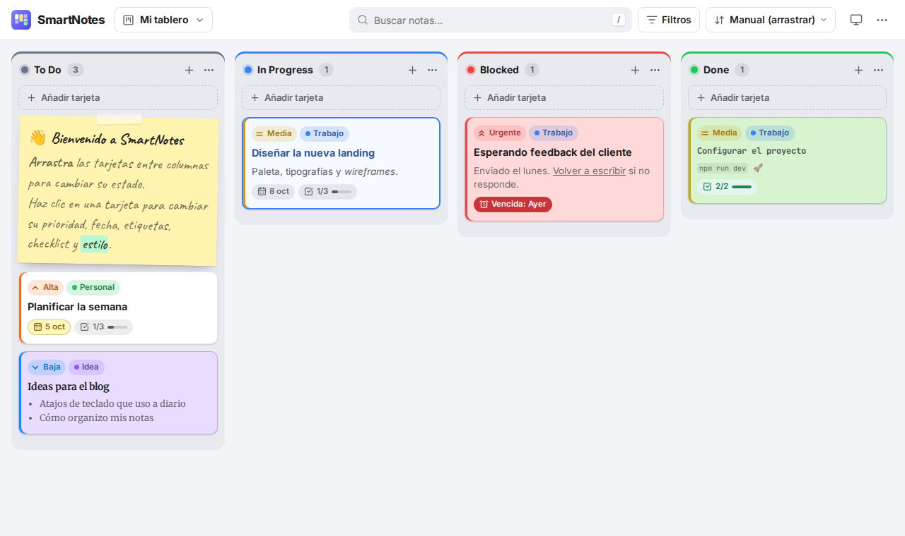
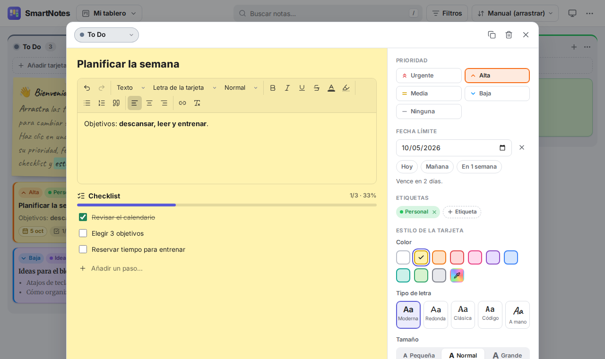
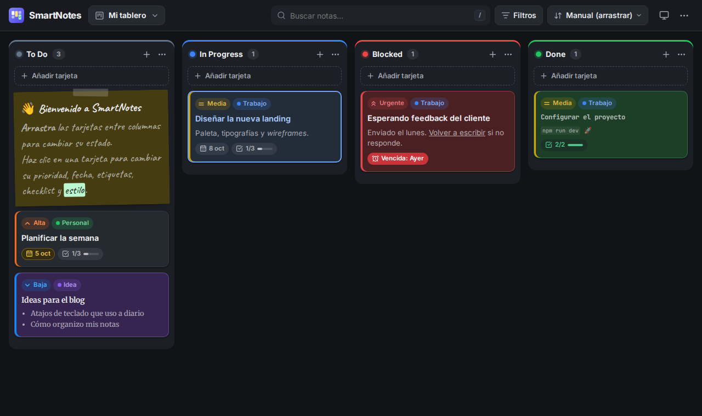
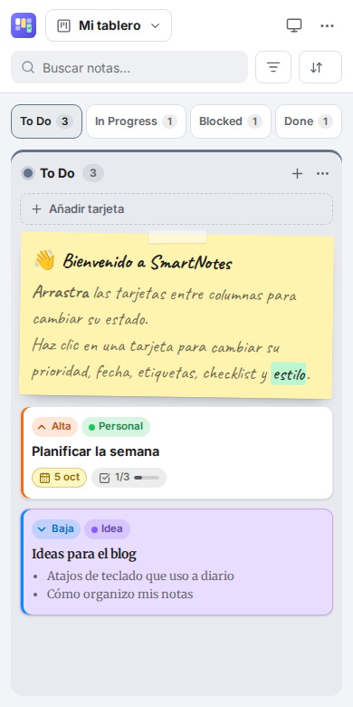

# SmartNotes

Aplicación de notas organizada como un tablero **kanban** con cuatro columnas: **To Do**, **In Progress**, **Blocked** y **Done**.
Cada tarjeta tiene prioridad, fecha límite, etiquetas, checklist y estilo propio (color, tipo de letra, tamaño y formato).



## Funciones

- **Kanban con arrastrar y soltar**: mueve tarjetas entre columnas o reordénalas, con ratón, en pantallas táctiles (mantén pulsado) o con el teclado (`Espacio` para levantar, flechas para mover).
- **Prioridades**: Urgente, Alta, Media, Baja o ninguna, con una franja de color en cada tarjeta. Puedes ordenar el tablero por prioridad, por fecha límite o por última edición.
- **Texto enriquecido**: negrita, cursiva, subrayado, tachado, títulos, listas, citas, enlaces, alineación, color del texto, resaltado, tipo y tamaño de letra.
- **Estilo por tarjeta**: 10 colores adaptados al modo claro/oscuro más un color personalizado; 5 tipos de letra (moderna, redonda, clásica, código y a mano), 3 tamaños y 3 formatos (tarjeta, post-it y contorno). Con «Usar por defecto», las tarjetas nuevas se crean con ese estilo.
- **Columnas personalizables**: nombre, color y límite WIP, que te avisa cuando hay demasiadas tareas a la vez.
- **Fechas límite** con avisos de tareas vencidas, que vencen hoy o en los próximos días.
- **Checklists** con barra de progreso.
- **Etiquetas**, **búsqueda** (ignora mayúsculas y acentos) y **filtros** por prioridad, etiqueta y fecha.
- **Varios tableros** (por ejemplo, Trabajo y Personal), y puedes mover tarjetas de un tablero a otro.
- **Modo oscuro** (claro, oscuro o el del sistema).
- **Funciona sin conexión** y se puede **instalar como app** (PWA) en el móvil o el ordenador, con el botón «Instalar app» que aparece arriba cuando el navegador lo permite.
- **Copia de seguridad**: exporta e importa todos tus datos en un archivo JSON.
- **Deshacer** al borrar una tarjeta y **atajos de teclado** (pulsa `?` dentro de la app).

| Editor de tarjetas | Modo oscuro | Móvil |
| --- | --- | --- |
|  |  |  |

## Empezar

Requisitos: [Node.js](https://nodejs.org) 20.19 o superior (o 22.12+).

```bash
npm install
npm run dev
```

Abre <http://localhost:5173>. La primera vez verás un tablero de ejemplo; borra esas tarjetas cuando quieras.

### Scripts

| Comando             | Qué hace                                           |
| ------------------- | -------------------------------------------------- |
| `npm run dev`       | Servidor de desarrollo con recarga automática      |
| `npm run build`     | Comprueba los tipos y genera la versión final en `dist/` |
| `npm run preview`   | Sirve la versión de `dist/` para probarla          |
| `npm test`          | Tests unitarios (Vitest)                           |
| `npm run lint`      | Linter (Oxlint)                                    |
| `npm run typecheck` | Solo la comprobación de tipos de TypeScript        |

## Publicarla gratis en GitHub Pages

El workflow `.github/workflows/ci.yml` pasa el linter, los tests y el build en cada push. En cada push a `main`, además, publica la app compilada en la rama `gh-pages`.

Si GitHub Pages no se activa solo, actívalo una vez en **Settings → Pages → Build and deployment**: **Source** «Deploy from a branch», rama **`gh-pages`**, carpeta **`/ (root)`**, y **Save**.

La app quedará en `https://<tu-usuario>.github.io/<repositorio>/` (en este repo, <https://mtdanielbri.github.io/SmartNotes/>). Desde el móvil, ábrela y usa «Añadir a pantalla de inicio» para instalarla.

La versión final usa rutas relativas, así que funciona en cualquier subcarpeta o servidor estático (Netlify, Vercel, Cloudflare Pages…).

## Tus datos

- Todo se guarda en el **`localStorage` de tu navegador**: no hay servidor ni cuentas, y nadie más ve tus notas.
- Cada navegador y dispositivo tiene sus propios datos. Si borras los datos del navegador, se pierden las notas: **exporta una copia** de vez en cuando (menú `⋯` → Exportar).
- Si tienes la app abierta en varias pestañas, se sincronizan entre sí.
- Al importar se valida el archivo: lo que no sea válido se corrige o se descarta, y el HTML se limpia para evitar código malicioso.

## Estructura del proyecto

```
src/
├── components/
│   ├── board/      Tablero, columnas, tarjetas, alta rápida y pestañas del móvil
│   ├── editor/     Ventana de edición: texto enriquecido, checklist, etiquetas, estilo
│   ├── topbar/     Selector de tableros, búsqueda, filtros, orden, tema y menú
│   ├── dialogs/    Gestor de etiquetas y ayuda
│   └── ui/         Piezas reutilizables: modal, popover, avisos, confirmación
├── store/          Estado con Zustand (persistido en localStorage) y datos de ejemplo
├── lib/            Lógica pura y testeada: filtros, fechas, colores, HTML seguro, copias
├── hooks/          Tema, media queries, fecha actual y atajos de teclado
└── styles/         Variables de diseño (modo claro/oscuro) y estilos base
```

**Tecnologías:** React 19, TypeScript, Vite, Zustand + Immer, @hello-pangea/dnd (arrastrar y soltar), TipTap (editor de texto), Zod (validación), DOMPurify, Lucide (iconos), vite-plugin-pwa y fuentes de Fontsource (incluidas en la app, sin depender de Google Fonts).

## Recomendaciones y próximos pasos

Ideas ordenadas de más a menos útil:

1. **Sincronizar entre dispositivos.** Ahora mismo las notas viven en un solo navegador. El siguiente paso natural es una base de datos en la nube con inicio de sesión (Supabase o Firebase). La capa de datos está separada en `src/store`, así que se puede cambiar sin tocar la interfaz.
2. **Recordatorios.** Notificaciones del navegador cuando una tarea vence, o un resumen diario.
3. **Motivo del bloqueo.** Al mover una tarjeta a *Blocked*, pedir «¿qué la bloquea?» y mostrarlo en la tarjeta. Ayuda mucho a desbloquearlas.
4. **Archivo automático.** Archivar las tarjetas que lleven X días en *Done* para que la columna no crezca sin fin, con una vista para consultarlas.
5. **Tareas recurrentes y plantillas.** Por ejemplo, «Revisión semanal» cada lunes, o una plantilla de checklist para tareas repetidas.
6. **Otras vistas.** Calendario por fecha límite y lista compacta para buscar rápido.
7. **Imágenes y adjuntos.** Guardándolos en IndexedDB, porque `localStorage` tiene un límite de unos 5 MB.
8. **Tests end-to-end** con Playwright en el CI para probar el arrastrar y soltar y el editor en cada cambio.

Consejos de uso: pon un **límite WIP de 2–3** en *In Progress* para no empezar demasiadas cosas a la vez, revisa *Blocked* cada día y usa las **etiquetas** para separar contextos (Trabajo, Personal, Ideas) en lugar de crear demasiados tableros.
